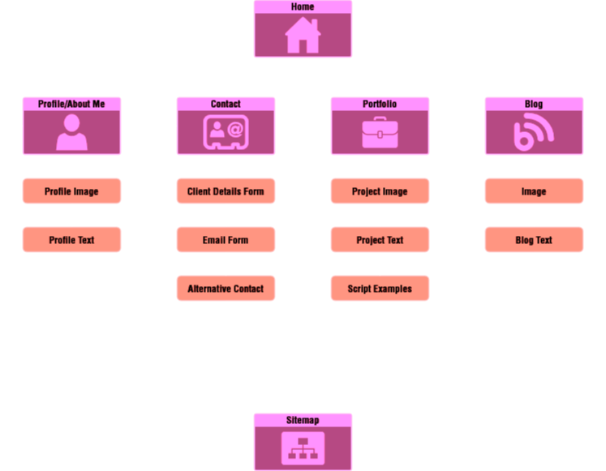
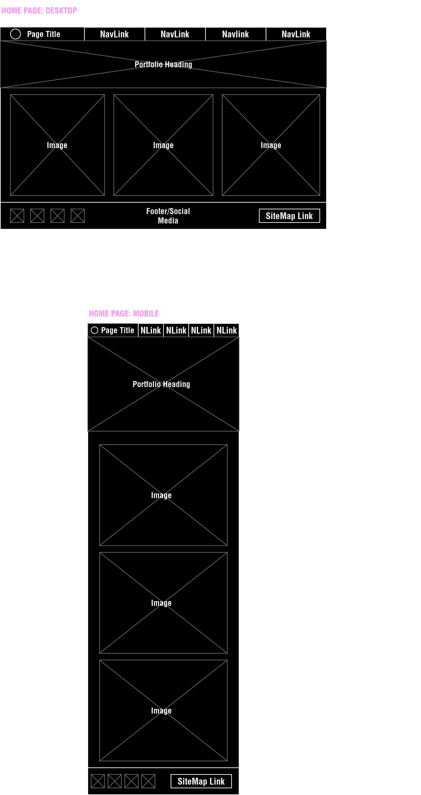

# JAMES MURPHY PORTFOLIO PROJECT

## PROJECT REPOSITORY - JAMESMURPHY_T1A2

[**Link To GitHub Repository**](https://github.com/SteaneMurphy/JamesMurphy_T1A2)

Clone (HTTPS): https://github.com/SteaneMurphy/JamesMurphy_T1A2.git

## PROJECT DESCRIPTION

This project is a portfolio website. It's purpose is to showcase my abilities as a Game Developer and Web Developer.

The portfolio consists of multiple pages, highlighting different web components and techniques as well as previous and current projects.

## SCREENSHOTS

## SITEMAP

## COMPONENT LIST

## WIREFRAMES

## TARGET AUDIENCE

## TECH STACK