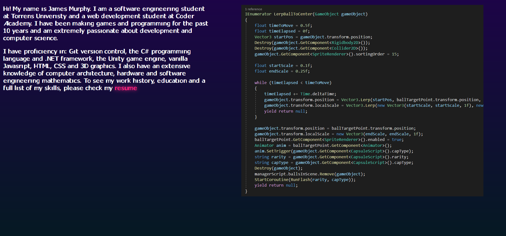
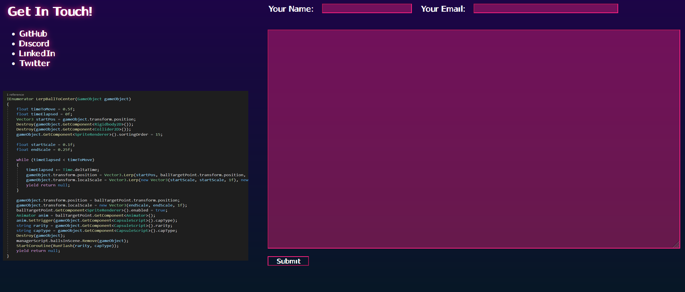

# JAMES MURPHY PORTFOLIO PROJECT

## PROJECT REPOSITORY - JAMESMURPHY_T1A2

[**Link To GitHub Repository**](https://github.com/SteaneMurphy/JamesMurphy_T1A2)

Clone (HTTPS): https://github.com/SteaneMurphy/JamesMurphy_T1A2.git

## PROJECT DESCRIPTION

This project is a portfolio website. It's purpose is to showcase my abilities as a game developer and web developer.

The portfolio consists of multiple pages, highlighting different web components and techniques as well as previous and current projects.

## SCREENSHOTS

## SITEMAP

The site consists of the following pages:

- Home
    - The landing page
- About Me
    - Description of skills and link to resume
- Contact
    - Links to social media and email form
- Portfolio
    - Placeholder portfolio components examples
- Blog
    - Placeholder blog component examples

The user can navigate the site by the use of links in the navigation bar. This navigation bar will follow the user as they scroll through the page.

## COMPONENT LIST

The site is made up of the following components:

### Navigation Bar

The navigation bar is a re-usable component that contains links to the other pages that make up the site as well as indicating which page the user is currently on. The navigation bar is fixed to the top of the viewport, following the user as they scroll down the page. This component allows the user to move to another page with ease.

The navbar is made up of:

- logo image
- text elements
- links

### Footer/Social Media Bar

The footer/social media bar is a re-usable component at the bottom of each page on the site. It contains links to social media accounts in the form of interactable icons.

The footer is made up of:

- social media icon images
- links
- text element

### Header

The header is a component that appears on the home page. The component contains:

- two text elements
- background image

### Main Component

The main component is different for each page and is custom styled due to the different content on each page

- About Me

The about me page contains information about my studies, skills and a link to my resume (placeholder). This component contains text and image elements

- Contact

The contact page contains links to all ways of contacting me as well as an input form that sends an email to me, allowing the user immediate communicaiton. This component contains links, text, image and form/input elements

- Portfolio

The portfolio page contains a re-usable component that display an image alongside some text. Each component has a header text. The purpose of this page is to show current and past projects in both game and web development

- Blog

The blog page contains a set of links with date/time stamps. Each link takes the user to the associate blog further down the page. This component contains links, text, time/date and image elements.

## WIREFRAMES

The layout of the page is designed to be responsive to multiple different device widths. The media breakpoints used are:

- smaller mobile devices < 400px wide
- modern mobile devices < 500px wide
- tablets < 900px
- desktop and laptop displays > 900px

The general idea is that horizontal content is converted into vertical content as the screen gets smaller. For example, adjacent images would stack on top of each other, or a text would appear below its associated image.

The colour scheme for the site was chosen to invoke a synthwave aethestic and emphasise the game development and creative side of the portfolio. Lighter colours were used for text and accents, the darker colours were used to provide contrast and a darker background so that content can stand out.

All links change to an accent colour when hovered over to indicate to the user that it is a link

## TARGET AUDIENCE

The target audience for this site would be a game or web development professional or a client looking to hire me for freelance work

## TECH STACK

The tech stack that was used to create this site:

- Draw.IO
- VSCode
- Unity
- HTML
- CSS
- Git

## REFERENCES

