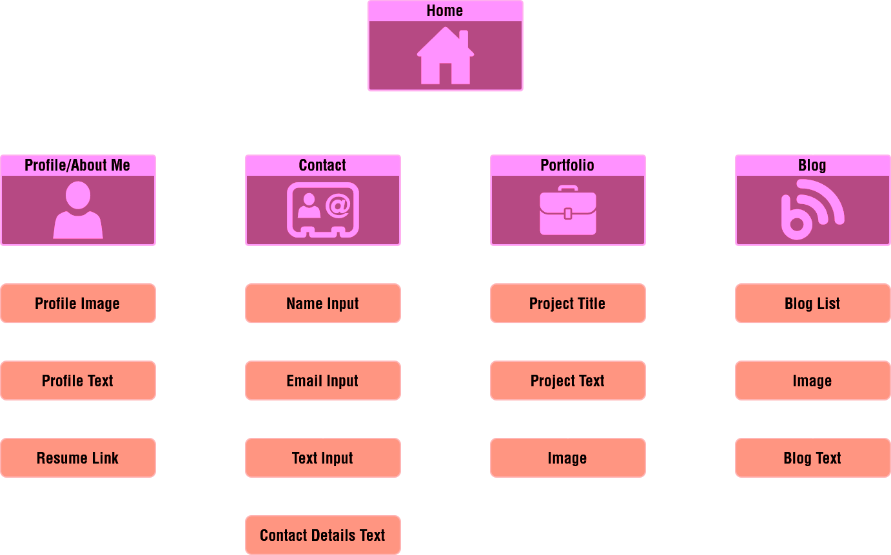

# JAMES MURPHY PORTFOLIO PROJECT

## PROJECT REPOSITORY - JAMESMURPHY_T1A2

[**Link To GitHub Repository**](https://github.com/SteaneMurphy/JamesMurphy_T1A2)

Clone (HTTPS): https://github.com/SteaneMurphy/JamesMurphy_T1A2.git

## PROJECT DESCRIPTION

This project is a portfolio website. It's purpose is to showcase my abilities as a game developer and web developer.

The portfolio consists of multiple pages, highlighting different web components and techniques as well as previous and current projects.

## SCREENSHOTS

## SITEMAP

The site consists of the following pages:

- Home
- About Me
- Contact
- Portfolio
- Blog

The user can navigate the site by the use of links in the navigation bar. This navigation will follow the user as they scroll through the page.

## COMPONENT LIST

The site is made up of the following components:

### Navigation Bar

The navigation bar is a re-usable component that contains linsk to the other pages that make up the site as well as indicating which page the user is currently on. The navigation bar is fixed to the top of the viewport, following the user as they scroll down the page.

The navbar is made up of:

- logo image
- text elements
- links

### Footer/Social Media Bar

The footer/social media bar is a re-usable component at the bottom of each page on the site. It contains links to social media accounts in the form of interactable icons.

The footer is made up of:

- social media icon images
- links
- text element (copyright)

### Header

The header is a component that appears on the home page. The component contains:

- two text elements
- background image

### Main Component

The main component is different for each page and is custom styled due to the different content on each page. This component has been used to present:

- blogs
- images
- text elements
- portfolio pieces
- input form
- time/date elements

## WIREFRAMES

The layout of the page is designed to be responsive to multiple different device widths. The media breakpoints used are:

- smaller mobile devices < 400px wide
- modern mobile devices < 500px wide
- tablets < 900px
- desktop and laptop displays > 900px

The colour scheme for the site was chosen to invoke a synthwave aethestic and emphasise the game development and creative side of the portfolio. Lighter colours were used for text and accents, the darker colours were used to provide contrast and a darker background so that content can stand out.

## TARGET AUDIENCE

The target audience for this site would be a game or web development professional.

## TECH STACK

The tech stack that was used to create this site:

- Draw.IO
- VSCode
- Unity
- HTML
- CSS
- Git